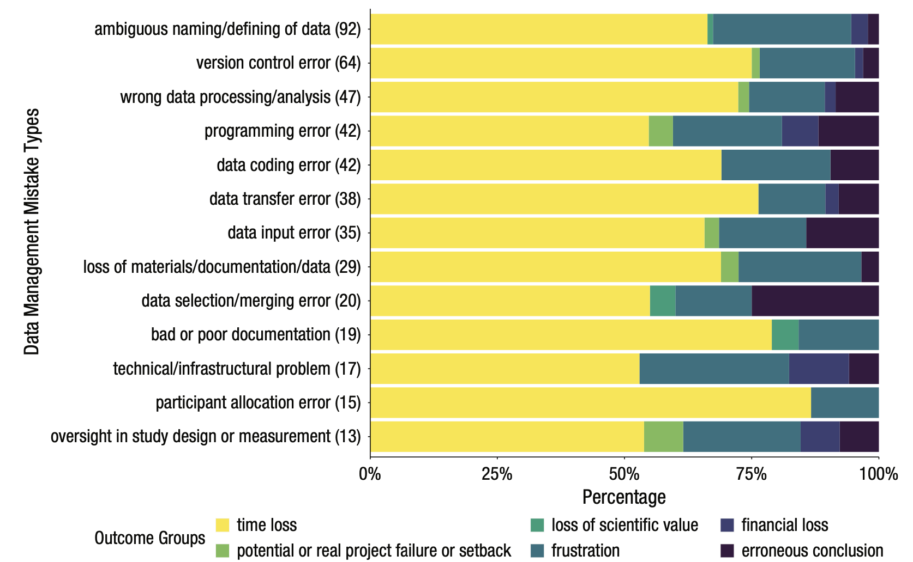

```{r xaringanExtra, echo=FALSE}
xaringanExtra::use_xaringan_extra(c("tile_view","broadcast"))
```

```{r xaringan-themer, include=FALSE, warning=FALSE}
# Set up custom theme
library(xaringanthemer)
style_mono_accent(
  base_color = "#1c5253",
  header_font_google = google_font("Josefin Sans"),
  text_font_google   = google_font("Montserrat", "300", "300i"),
  code_font_google   = google_font("Fira Mono"),
  base_font_size = "20px",
  text_font_size = "1.5rem",
  header_h1_font_size = "3rem",
  header_h2_font_size = "2.5rem",
  header_h3_font_size = "2rem",
)
```

```{r, include = F}
knitr::opts_chunk$set(fig.width = 6, message = FALSE, warning = FALSE, comment = "", cache = F)
library(flipbookr)
library(tidyverse)
library(icons) #https://fontawesome.com/v5.15/icons?d=gallery&p=2&m=free
```
# How can R data processing help us minimize mistakes?

.center[]

---
# How can R data processing help us minimize mistakes?
- Code *is* documentation
- Transform data with less human intervention
- But coding errors are also common...what can we do to make sure that our code works?
  * Instead of “hard” coding based on position (such as ds[1, 2]), filter and select by name and logical conditions
  * Use good coding practices to clean up variable names to make them human-readable
  * Reduce code duplication (copy-paste-tweak) with loops and functions
  * Write code that's reproducible (avoiding absolute file paths)

---
# Data type and transformation tutorial

- Data types

- Logical statements

- Introduction to *dplyr*

<br />
<br />
 
.content-box-blue[
`r icons::fontawesome("github")` Follow along from the [Github repo](https://github.com/psych-259-data-science-2022/259-data-transformations)
]

.footnote[.small[.bold[Last updated: `r Sys.Date()`]]]

---
# Data types
- Why have pre-defined types?
  * Allows software to efficiently store data in memory
  * If a value is an integer (1, 2, 3, 4) storing it as an integer makes calculations easier compared to storing it as a double (2.34542480424624086)
  
- Allows software to implement rules about transformations
  * Addition/subtraction for a date follows different rules compared with integers/double
  * “Less than” makes sense when comparing numbers, but not when comparing strings

---
# Common data types in R
- Numeric
  * integer: 1, 2, 3
  * double: 1.12124
  
- Character: “hello”

- Logical: T/F (TRUE/FALSE)

- Datetime

- Factor

- Use `typeof()` function to check type of a value, `str()` or `glimpse()` to check the types of each column of a tibble

---
# Functions to test and convert types

- Take a value and convert it into a different type
  * `as.numeric()`, `as.character()`, `as.date()`

- Check if something is a particular type
  * `is.numeric()`, `is.character()`

---
`r chunk_reveal("types", break_type = "auto", widths = c(2, 1), title = "# Data types")`

```{r types, include = FALSE}
x <- 1
x
typeof(x)
is.numeric(x)
is.character(x)
as.character(x)
x + 1

x <- "data.csv"
typeof(x)
is.numeric(x)
is.character(x)
as.numeric(x)
#"data_raw" + x
paste0("data_raw/",x)
```

---
# Missing values

- `NA` means missing data in R

- `is.na()` checks whether a value is missing

- not to be confused with `NULL` (empty), or `NaN` (not a number) 

---
`r chunk_reveal("missing", break_type = "auto", widths = c(2, 1))`

```{r missing, include = FALSE}
x <-  c(1, 2, 3, NA)
print(x)
is.na(x)
mean(x)
mean(x, na.rm = TRUE)

x <- c(1, 2, 3, NULL)
x
```
---
# Logical comparisons 

- Comparisons between values that result in TRUE/FALSE

- Greater than/less than (>, >=, <, <=)

- Equals (==)

- Not equals (!=)

- Not (!)

- And (&)

- Or (|)

- %in%

---
`r chunk_reveal("logical", break_type = "auto", widths = c(2, 1), title = "# Logical comparisons")`

```{r logical, include = FALSE}
x <- 1
x > 0
x > 2
x == 1
x != 2
!(x == x)
"s" == "S"
1 > 0 | 0 > 1
1 > 0 & 0 > 1

# Element-wise logical statements
x <- c(-1, 0, 1)
x < 0
x == 0

# Quickly test is a value is contained in a set
1 %in% x
```

---
# How do we use logical statements?

- One common way is through the `ifelse()` command?

- `ifelse(LOGICAL STATEMENT, DO IF TRUE, DO IF FALSE)`

```{r}
x <- c(0, 1, 2, 3, NA)
ifelse(NA %in% x, "x contains a missing value", "x does not contain a missing value")

x <- c(0, 1, 2, 3)
ifelse(NA %in% x, "x contains a missing value", "x does not contain a missing value")
```

---
# Data transformation with the dplyr package

- A toolbox for common data processing/manipulation operations to apply to tibbles
  * `glimpse()` to see the structure of a tibble
  * `arrange()` to sort data by columns
  * `filter()` and `slice()` to subset data by rows
  * `select()` to subset data by columns
  * `rename()` to rename columns
  * `mutate()` to add or change columns (or their values)
  * `summarize()` and `count()` to calculate summary statistics over rows of data
  * `group_by()` to perform operations within subsets of data
  * and many more...

---
# Each dplyr function uses a similar structure
- `function(data, something_to_do_with_columns)`

- In base R, you often need to specify the dataset over and over to access the columns: `ds[ds$col1 == 1, 0]`

- In dplyr functions, the data argument lets you work with column names without ever using `$`. The data argument also lets you access the columns directly without using quoted expressions: `filter(data, col1 == 1)`

- Most dplyr functions return the entire tibble back as an output

---
`r chunk_reveal("arrange", break_type = "rotate", float = "none", widths = c(5, 1), title = "## Arrange (sorting data)")`

```{r arrange, include = FALSE}
library(tidyverse) #loads dplyr
ds <- starwars #loads built-in star wars database
glimpse(ds) #ROTATE
arrange(ds, name) #ROTATE
arrange(ds, height) #ROTATE
arrange(ds, desc(height), mass) #ROTATE
arrange(ds, eye_color, hair_color) #ROTATE
```

---
`r chunk_reveal("filter", break_type = "rotate", float = "none", widths = c(5, 1), title = "# Filter (subsetting rows)")`

```{r filter, include = FALSE}
filter(ds, height < 100) #ROTATE
filter(ds, name == "Yoda") #ROTATE
filter(ds, is.na(hair_color)) #ROTATE
filter(ds, height > 100, height < 150) #ROTATE
filter(ds, eye_color %in% c("blue","brown")) #ROTATE
filter(ds, !(eye_color %in% c("blue","brown"))) #ROTATE
```

---
`r chunk_reveal("slice", break_type = "rotate", float = "none", widths = c(5, 1), title = "# Slice (subsetting rows by position)")`

```{r slice, include = FALSE}
slice(ds, 1:5) #ROTATE
slice_head(ds, n = 5) #ROTATE
slice_tail(ds, n = 4) #ROTATE
slice_sample(ds, n = 2) #ROTATE
slice_sample(ds, n = 2) #ROTATE
slice_min(ds, height, n = 3) #ROTATE
```

---
`r chunk_reveal("select", break_type = "rotate", float = "none", widths = c(5, 1), title = "# Select (subsetting columns)")`

```{r select, include = FALSE}
select(ds, name) #ROTATE
select(ds, name, height, mass) #ROTATE
select(ds, c("name", "height", "mass")) #ROTATE
select(ds, name:eye_color) #ROTATE
select(ds, -(eye_color:starships)) #ROTATE
select(ds, ends_with("color")) #ROTATE
select(ds, contains("_")) #ROTATE
select(ds, where(is.numeric)) #ROTATE
select(ds, where(is.character)) #ROTATE
```

---
`r chunk_reveal("noassignment", break_type = "auto", widths = c(1, 1), title = "# What's going on here?")`

```{r noassignment, include = FALSE}
select(ds, name, height, eye_color)
filter(ds, height < 70)
ds
```

---
`r chunk_reveal("reassignment", break_type = "auto", left_assign = T, widths = c(1, 1), title = "# Reassign the transformations back to the tibble")`

```{r reassignment, include = FALSE}
ds <- select(ds, name, height, eye_color)
ds <- arrange(ds, height, eye_color)
ds <- filter(ds, height < 70)
```

---
`r chunk_reveal("intermed", break_type = "auto", float = "none", widths = c(5, 1), title = "# Not a good strategy")`

```{r intermed, include = FALSE}
ds <- starwars
ds_name_height_eye_color <- select(ds, name, height, eye_color)
ds_sorted <- arrange(ds_name_height_eye_color, height, eye_color)
ds_sorted_filtered <- filter(ds_sorted, height < 70)
ds_sorted_filtered
```

---
`r chunk_reveal("pipe", break_type = "auto", float = "none", left_assign = T, widths = c(5, 1), title = "# Introducing the pipe operator: %>% ")`

```{r pipe, include = FALSE}
ds <- starwars
ds <- ds %>% select(name, height, eye_color)

ds <- ds %>% 
  select(name, eye_color) %>% 
  arrange(eye_color) %>% 
  filter(eye_color == "blue")
```

---
# This is not the most intuitive thing at first

All the options below are equivalent, but I stick with `ds <- ds %>%` because it's the most common to see

```{r, eval = F}
ds <- ds %>% select(height) %>% slice_tail(n = 5)

ds %>% select(height) %>% slice_tail(n = 5) -> ds

ds <- select(ds, height) %>% slice_tail(n = 5)

ds <- slice_tail(select(ds, height), n = 5)
```

---
# Rename

- Consistent and clear names help prevent errors
  * Avoid names like "dv1", "dv2" that are difficult to remember
  * Auto-complete within RStudio means that you don't usually need to type out longer names

- Using rename can help clean up messy names from other sources
  * Avoid names that contain spaces or start with numbers
  * Force names to use a similar format like snake_case or camelCase

- Installing and loading the `janitor` package opens up some helpful renaming options

---
`r chunk_reveal("rename", break_type = "rotate", float = "none", widths = c(5, 1), title = "# Rename columns")`

```{r rename, include = FALSE}
library(janitor)
# Switching to built-in iris data set since starwars has good names
iris #ROTATE
iris %>% rename(sepal_length = Sepal.Length) #ROTATE
iris %>% rename(sepal_length = Sepal.Length, sepal_width = Sepal.Width, petal_length = Petal.Length, petal_width = Petal.Width, species = Species) #ROTATE
iris %>% rename_with(toupper) #ROTATE
iris %>% rename_with(tolower, starts_with("Petal")) #ROTATE
iris %>% clean_names() #ROTATE
iris %>% clean_names("small_camel") #ROTATE
```
---
# Mutate and summarize

- Mutate adds/modifies columns; dataset remains the same size
- Summarize collapses the data set down (by default to 1 row) to calculate summary statistics
- Both functions use a similar form:
  * `mutate(data, new_variable = expression)`
  * `summarize(data, mean = mean(var))`
- Like all other dplyr functions, they return tibbles, so for mutate to "stick" it needs to be assigned back to itself:
  * `data <- mutate(data, var = round(var))`
  * `data <- mutate(data, var_r = round(var))`
- Since summarize collapses to a new level, you might not want to assign it to overwrite the original data set!

---
`r chunk_reveal("mutate", break_type = "auto", float = "none", left_assign = T, widths = c(5, 1), title = "# Mutate (add or modify columns)")`

```{r mutate, include = FALSE}
ds <- starwars %>% select(name, mass, height, hair_color)
ds <- ds %>% mutate(in_movie = "yes")
ds <- ds %>% mutate(height_m = height/100,
                    bmi = mass/(height_m^2),
                    bmi = round(bmi)) %>% 
            arrange(desc(bmi))

ds <- ds %>% 
  filter(hair_color %in% c("blond", NA)) %>% 
  mutate(hair_color = ifelse(is.na(hair_color),"no hair", hair_color),
         mass = ifelse(mass > 1000, "huge", "not huge"))
```

---
# Tricky, common task: Changing some but not all values within a column

```{r}
# Change all NA values to "no hair", keep all others the same
ds <- ds %>% mutate(hair_color = ifelse(is.na(hair_color),"no hair", hair_color))

# Set all heights greater than 100 to 100, keep all others the same
ds <- ds %>% mutate(height = ifelse(height > 100,100, height))
```

---
`r chunk_reveal("summarize", break_type = "auto", widths = c(1.2, 1), title = "# Summarize (calculate variables in aggregate)")`

```{r summarize, include = FALSE}
ds <- starwars %>% select(name, mass, height, species)
ds %>% summarize(min_height = min(height))
ds %>% summarize(min_height = min(height, na.rm = T))

ds %>% summarize(min_height = min(height, na.rm = T),
                 m_height = mean(height, na.rm = T),
                 max_height = max(height, na.rm = T))

ds %>% group_by(species) %>% 
  summarize(min_height = min(height, na.rm = T),
                 m_height = mean(height, na.rm = T),
                 max_height = max(height, na.rm = T),
                 n = n())
```

<!-- adjust font size and other formatting defs in this css code chunk -->
```{css, eval = TRUE, echo = FALSE}
.remark-code{line-height: 1; font-size: 70%}

@media print {
  .has-continuation {
    display: block;
  }
}

code.r.hljs.remark-code{
  position: relative;
  overflow-x: hidden;
}

.remark-slide-number {
  opacity: 0; /* default: 0.5 */
}

.content-box { 
    box-sizing: border-box;
    background-color: #e2e2e2;
}
.content-box-blue,
.content-box-gray,
.content-box-grey,
.content-box-army,
.content-box-green,
.content-box-purple,
.content-box-red,
.content-box-yellow {
  box-sizing: border-box;
  border-radius: 15px;
  margin: 0 0 15px;
  overflow: hidden;
  padding: 0px 20px 0px 20px;
  width: 100%;
}
.content-box-blue { background-color: #F0F8FF; }
.content-box-gray { background-color: #e2e2e2; }
.content-box-grey {	background-color: #F5F5F5; }
.content-box-army {	background-color: #737a36; }
.content-box-green { background-color: #d9edc2; }
.content-box-purple { background-color: #e2e2f9; }
.content-box-red { background-color: #ffcccc; }
.content-box-yellow { background-color: #fef5c4; }
.content-box-blue .remark-inline-code,
.content-box-blue .remark-inline-code,
.content-box-gray .remark-inline-code,
.content-box-grey .remark-inline-code,
.content-box-army .remark-inline-code,
.content-box-green .remark-inline-code,
.content-box-purple .remark-inline-code,
.content-box-red .remark-inline-code,
.content-box-yellow .remark-inline-code { 
  background: none;
}

.scroll-box-8 {
  height:8em;
  overflow-y: scroll;
}
.scroll-box-10 {
  height:10em;
  overflow-y: scroll;
}
.scroll-box-12 {
  height:12em;
  overflow-y: scroll;
}
.scroll-box-14 {
  height:14em;
  overflow-y: scroll;
}
.scroll-box-16 {
  height:16em;
  overflow-y: scroll;
}
.scroll-box-18 {
  height:18em;
  overflow-y: scroll;
}
.scroll-box-20 {
  height:20em;
  overflow-y: scroll;
}
.scroll-output {
  height: 90%;
  overflow-y: scroll;
}
}

/************************
 * Font size and colours
 ************************/

/*      LaTeX style       */
.Large       , .Large .remark-code, .Large .remark-inline-code { font-size: 144%; }
.large       , .large .remark-code, .large .remark-inline-code { font-size: 120%; }
.small       , .small .remark-code, .small .remark-inline-code { font-size: 90%; }
.footnotesize, .footnotesize .remark-code, .footnotesize .remark-inline-code { font-size: 80%; }
.scriptsize  , .scriptsize .remark-code, .scriptsize .remark-inline-code { font-size: 70%; }
.tiny        , .tiny .remark-code, .tiny .remark-inline-code { font-size: 60%; }

/* or you can be more specific */
.font10 , .code10 .remark-code, .code10 .remark-inline-code{ font-size: 10%; }
.font20 , .code20 .remark-code, .code20 .remark-inline-code{ font-size: 20%; }
.font30 , .code30 .remark-code, .code30 .remark-inline-code{ font-size: 30%; }
.font40 , .code40 .remark-code, .code40 .remark-inline-code{ font-size: 40%; }
.font50 , .code50 .remark-code, .code50 .remark-inline-code{ font-size: 50%; }
.font60 , .code60 .remark-code, .code60 .remark-inline-code{ font-size: 60%; }
.font70 , .code70 .remark-code, .code70 .remark-inline-code{ font-size: 70%; }
.font75 , .code75 .remark-code, .code75 .remark-inline-code{ font-size: 75%; }
.font80 , .code80 .remark-code, .code80 .remark-inline-code{ font-size: 80%; }
.font90 , .code90 .remark-code, .code90 .remark-inline-code{ font-size: 90%; }
.font100, .code100 .remark-code, .code100 .remark-inline-code{ font-size: 100%; }
.font110, .code110 .remark-code, .code110 .remark-inline-code{ font-size: 110%; }
.font120, .code120 .remark-code, .code120 .remark-inline-code{ font-size: 120%; }
.font130, .code130 .remark-code, .code130 .remark-inline-code{ font-size: 130%; }
.font140, .code140 .remark-code, .code140 .remark-inline-code{ font-size: 140%; }
.font150, .code150 .remark-code, .code150 .remark-inline-code{ font-size: 150%; }
.font160, .code160 .remark-code, .code160 .remark-inline-code{ font-size: 160%; }
.font170, .code170 .remark-code, .code170 .remark-inline-code{ font-size: 170%; }
.font175, .code175 .remark-code, .code175 .remark-inline-code{ font-size: 175%; }
.font180, .code180 .remark-code, .code180 .remark-inline-code{ font-size: 180%; }
.font190, .code190 .remark-code, .code190 .remark-inline-code{ font-size: 190%; }
.font200, .code200 .remark-code, .code200 .remark-inline-code{ font-size: 200%; }

.brand-red { color: #e64626; }
.brand-blue { color: #0148A4; }
.brand-yellow { color: #FFB800; }
.brand-charcoal {color: #424242; }
.brand-gray {color: #F1F1F1;}
.brand-grey {color: #F1F1F1;}
.black { color: black; }
.white { color: white; }
.red { color: red; }
.blue { color: blue; }
.green { color: green; }
.yellow { color: yellow; }
.orange { color: orange; }
.purple { color: purple; }
.gray { color: gray; }
.grey { color: gray; }

.bold { font-weight: bold; }
.bolder { font-weight: bolder; }
```

